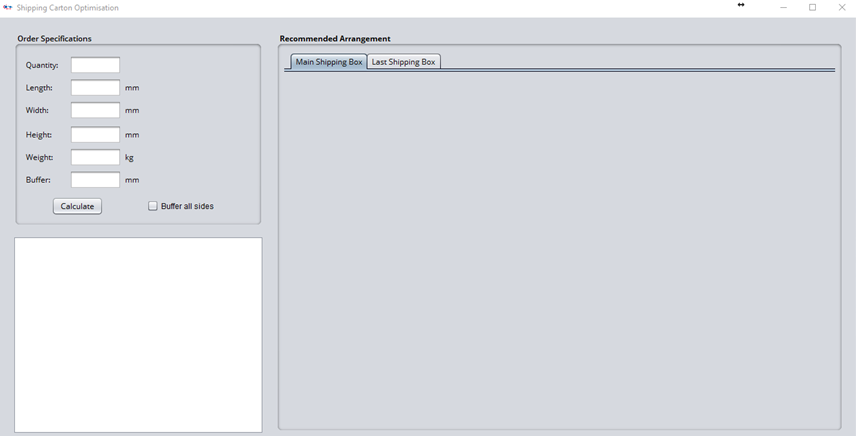

# Shipping Carton Optimisation
This program was created by NUS ISE SDP Group 11 for our System Design Project.

# User Guide

* [Installation Guide](#installation-guide)
* [Inputs](#inputs)
* [Outputs](#outputs)

## Installation Guide

### Before you start
1. This app runs on Java. Ensure that Java version `1.8.0_91` or later installed in your computer.
    > This app might not work with earlier versions of Java 8.
2. CPLEX is needed for the app to perform. Ensure that CPLEX version `12.7.1` or later is installed. Click [here](https://www.ibm.com/products/ilog-cplex-optimization-studio/pricing) to view the versions and pricing for CPLEX.
    > Not sure if the community edition can be used for this program, will check soon

### How to run
1. Download the jar from the releases tab. TODO: Add to releases
2. Double click the jar to run. Or might need to add the Djava thing in order to run it. TODO: check
3. The GUI should appear in a few seconds.
    > 
4. Type the fields in the `Order Specifications` panel and press <kbd>Enter</kbd> to determine the shipping carton boxes to be used.
5. Some example values you can try:
    * **`Quantity`** : 50
    * **`Length`** : 190
    * **`Width`** : 190
    * **`Height`** : 25
    * **`Weight`** : 0.3
6. Refer to the [Features](#features) section below for details of each field. 

## Inputs
### Example: Jiang Sze has just received an order of 100 product boxes. They are sized 25cm x 20cm x 3.5cm and weigh 300 grams each. By client request, every shipping box must have a buffer of 2cm on all sides of the box. 
#### `Quantity`
The number of product boxes to be packed. Input must be an integer format. 
This field is **mandatory**. 
*For our example, '100' should be keyed into this field.* 
#### `Length`
The length of the product box to be packed, in mm. Input must be an integer format. 
This field is **mandatory**. 
*For our example, '250' should be keyed into this field (since 25cm = 250mm).* 
#### `Width`
The width of the product box to be packed, in mm. Input must be an integer format. 
This field is **mandatory**. 
*For our example, '200' should be keyed into this field (since 20cm = 200mm).* 
#### `Height`
The height of the product box to be packed, in mm. Input must be an integer format. 
This field is **mandatory**. 
*For our example, '35' should be keyed into this field (since 3.5cm = 35mm).* 
#### `Weight`
The weight of the product box to be packed, in kg. Input must be an integer or decimal format. 
This field is **mandatory**. 
*For our example, '0.3' should be keyed into this field (since 300g = 0.3kg).* 
#### `Buffer`
The buffer to add to the sides of the shipping box, in mm. 
This field is **optional**. Buffer is assumed to be 0 if there is no input or if input is not in an integer format. 
*For our example, '20' should be keyed into this field (since 2cm = 20mm).* 
#### `Buffer all sides` checkbox 
Check if you wish to add the buffer to all 6 sides of the shipping box. 
Uncheck if you wish to only add the buffer to 3 sides of the shipping box (right, front, top). 
*For our example, this box should be checked, since the client requests for all sides to be buffered.* 

## Outputs
TBC
